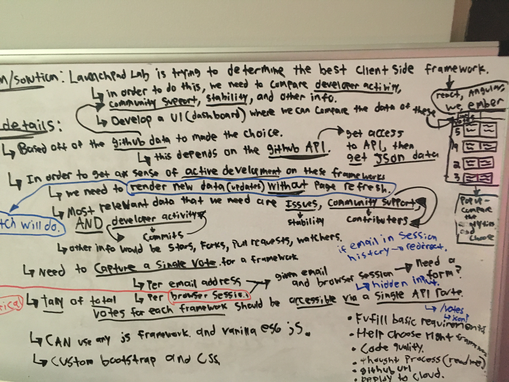
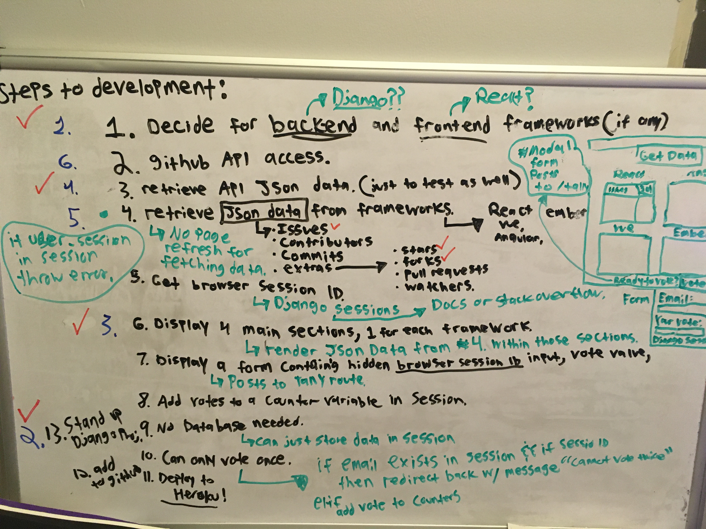

# Simple LaunchPad Lab Dashboard

### This project is designed to take in votes on one voting machine. People must take turns voting on a selected machine. The votes persist in session and emails and chosen framework are saved to a PostgreSQL database, where it is then checked to see if the email already exists, thus creating a one vote per email rule. I deployed to Heroku's cloud based platform utilizing their CLI/Toolbelt. Utilized Bootstrap as my CSS framework and used Django for the backend.

### This project follows these features/rules.
1. One vote per email address.
2. One Vote per voter session.
3. Votes are tallied on the root page for simplicity.
4. Information comes from the Github Public API on each framework.

# The process

1. My first step for any project begins with the whiteboard. As you can see below, this was step one: brainstorming.(pardon the chicken scratch)

2. After the brainstorming, I then begin to list steps that I need to take in order to bring the idea into reality. Below are my steps for development(once again, pardon the chicken scratch).

3. After the steps to development are listed, I then begin listing the features/tasks by number from easiest to hardest. 
4. After everything has been listed in the order I would tackle the problems, I then begin tackling each one by one until the application comes into existence. 
5. After features are built out, I then prepare the application for deployment by making sure no sensitive code gets accidently pushed into the github repo. I also set my enviornment variables and place any secrets into a .env file, which gets ignored by .gitignore

